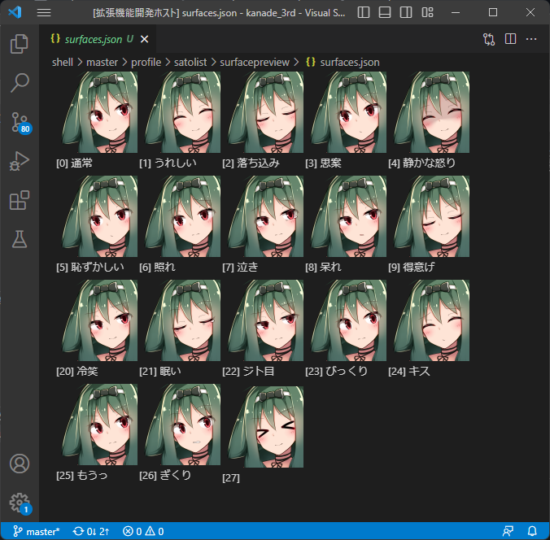

# SurfacePalette for VisualStudioCode from Satolist

* さとりすとのサーフェスパレットを、VisualStudio Codeにもってこれます。
* さとりすとでサーフェスパレットをつくると生成される、シェルフォルダの profile/satolist/surfacepreview/surfaces.json をVSCodeで開くとサーフェスパレットになります。
  * セキュリティのためシェルのフォルダがVSCodeに認識されていないと表示できません。辞書だけではなく、ゴーストのフォルダごとVSCodeでひらくのがおすすめ。
  * さとりすと 2.0.10 以降でサーフェスパレットの情報を出力する必要があります。

  